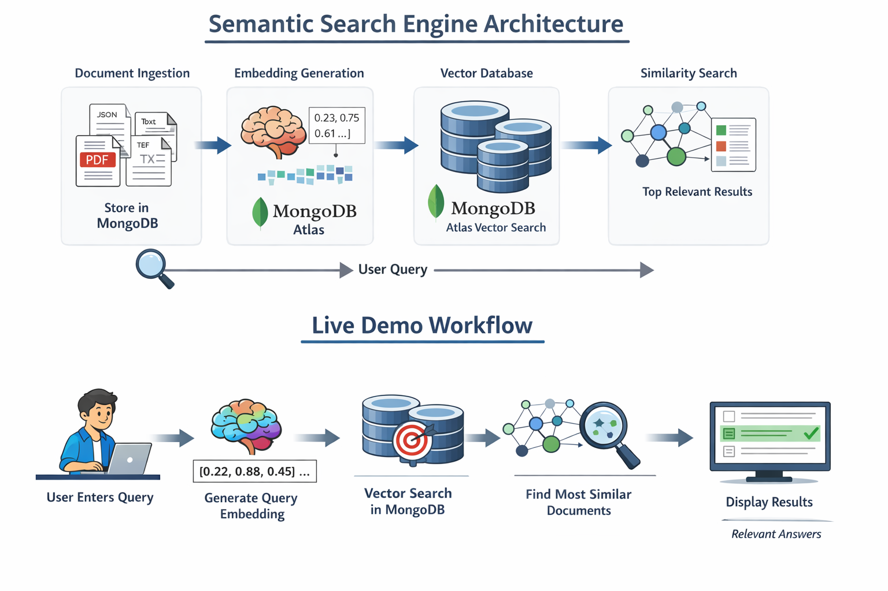
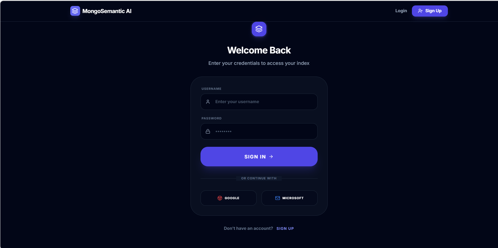
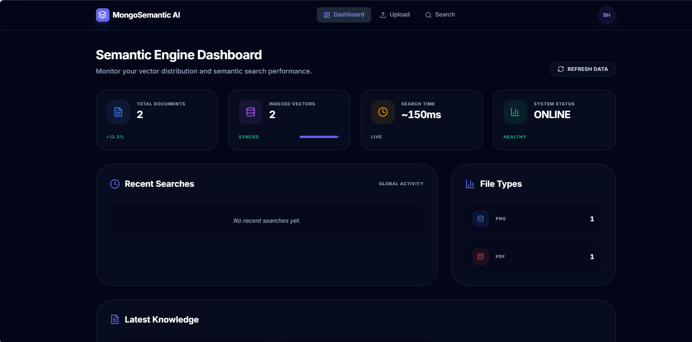
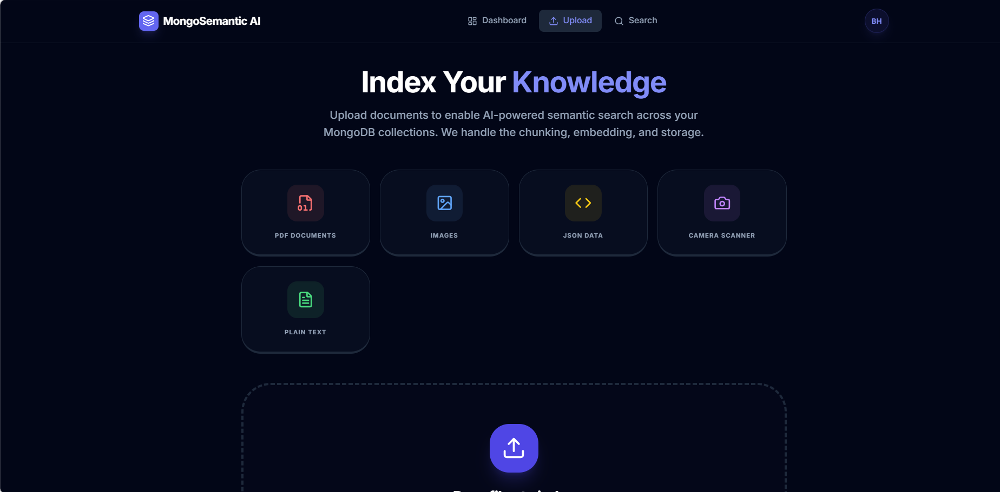
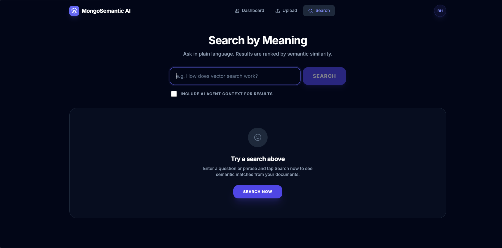
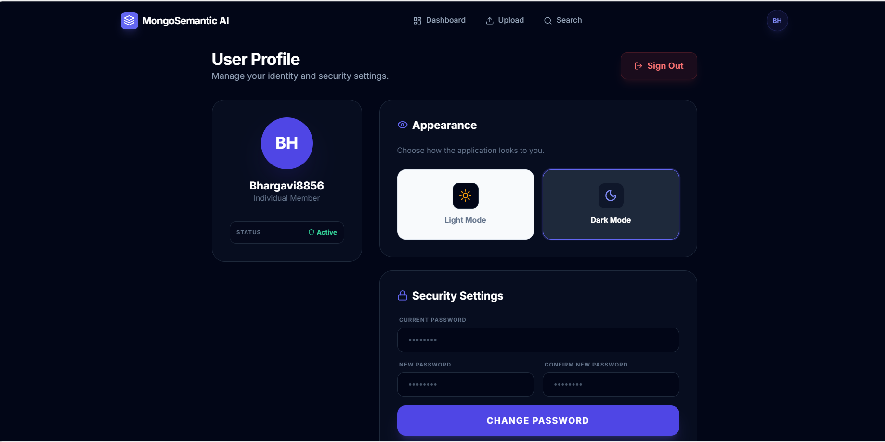

# Semantic Search Engine for Mongo DB Documents

Production-ready semantic search API using **MongoDB Atlas Vector Search**, **Node.js**, **Express**, and **OpenAI** (or Hugging Face) embeddings with **cosine similarity**.


## Project Overview

This project implements an AI-powered Semantic Search Engine using MongoDB Atlas Vector Search.

Traditional keyword-based search fails to understand user intent and meaning.
If the words in the query do not exactly match stored documents, relevant results are missed.

Our system converts documents and user queries into embeddings (numerical meaning representations) and performs cosine similarity search to return the most contextually relevant results.

This enables meaning-based intelligent search instead of simple keyword matching.


##  Problem Statement

Keyword-based search cannot understand:

- Synonyms
- Context
- User intent
- Natural language queries

Example:

Query: "account recovery"  
Document: "reset password steps"

Traditional search fails.  
Semantic search correctly retrieves the document.


##  Key Features

- Meaning-based semantic search
- MongoDB Atlas Vector Search
- OpenAI / Hugging Face embeddings
- Cosine similarity ranking
- REST API backend (Node.js + Express)
- React + Tailwind frontend
- Secure authentication (Atlas App Services)


##  System Architecture & User Flow



### How It Works

1. User uploads documents.
2. Documents are converted into embeddings.
3. Embeddings are stored in MongoDB.
4. User enters a search query.
5. Query is converted into embedding.
6. MongoDB performs vector similarity search.
7. Top relevant results are displayed with similarity scores.

---

##  Application Screenshots

###  Login Page


###  Dashboard


###  Upload Documents


###  Semantic Search


###  User Profile


---

## Tech Stack

- **Node.js** + **Express** – REST API
- **MongoDB Atlas** – document store + vector search
- **OpenAI** – embeddings (primary); **Hugging Face Inference API** – sentence-transformers fallback

## Requirements

- Node.js 18+
- MongoDB Atlas cluster (M10+ recommended for vector search)
- OpenAI API key **or** Hugging Face API key

## Setup

### 1. Install dependencies

```bash
npm install
```

### 2. Environment variables

Copy `.env.example` to `.env` and set:

```env
MONGODB_URI=mongodb+srv://<user>:<password>@<cluster>.mongodb.net/<database>?retryWrites=true&w=majority
MONGODB_DATABASE=semantic_search
MONGODB_COLLECTION=documents
OPENAI_API_KEY=sk-...
PORT=3000
```

For fallback embeddings (no OpenAI): set `HF_API_KEY` and leave `OPENAI_API_KEY` unset. The app uses **sentence-transformers**-style models via the Hugging Face Inference API (e.g. `sentence-transformers/all-MiniLM-L6-v2`). **Important:** the Atlas vector index dimensions must match the provider (OpenAI: 1536, HF default: 384).

### 3. Create the vector search index in Atlas

In **Atlas** → your cluster → **Search** → **Create Search Index** → **JSON Editor**:

- **Database:** same as `MONGODB_DATABASE`
- **Collection:** same as `MONGODB_COLLECTION`
- **Index name:** `vector_index` (or set `VECTOR_INDEX_NAME` in `.env`)

Use this definition (cosine similarity; dimensions must match your embedding model):

**OpenAI (1536 dimensions):**

```json
{
  "fields": [
    {
      "type": "vector",
      "path": "embedding",
      "numDimensions": 1536,
      "similarity": "cosine"
    }
  ]
}
```

**Hugging Face fallback (384 dimensions for all-MiniLM-L6-v2):**

```json
{
  "fields": [
    {
      "type": "vector",
      "path": "embedding",
      "numDimensions": 384,
      "similarity": "cosine"
    }
  ]
}
```

Save and wait for the index to finish building.

### 4. Run the server

```bash
npm start
```

Development with auto-reload:

```bash
npm run dev
```

## API

### Health

- **GET** `/health` – returns `{ status: "ok", service: "semantic-search" }`

### Ingest documents

- **POST** `/ingest`  
- **Body:** `{ "documents": [ { "content": "Text to embed...", "optionalField": "any" } ] }`  
- **Response:** `{ "message": "...", "inserted": 1, "ids": ["..."] }`  
- Each document must have a string `content` field. Optional `metadata`: `{ title?, tags?, source? }`. Embeddings are computed and stored in `embedding`. See **docs/SCHEMA.md**.

### Semantic search (cosine similarity)

- **POST** `/search`  
  - **Body:** `{ "query": "search phrase", "limit": 10, "numCandidates": 100 }`  
  - `limit` (default 10, max 100) and `numCandidates` (default 100) are optional.

- **GET** `/search?q=search+phrase&limit=10&numCandidates=100`  
  - Same behavior via query params.

- **Response:** `{ "query": "...", "count": N, "results": [ { "_id": "...", "content": "...", "metadata": { "title", "tags", "source" }, "score": 0.95 } ] }`  
  - `score` is the cosine similarity from Atlas (0–1).

## Example

```bash
# Ingest
curl -X POST http://localhost:3000/ingest \
  -H "Content-Type: application/json" \
  -d '{"documents":[{"content":"MongoDB is a document database","metadata":{"title":"MongoDB","tags":["database","nosql"],"source":"docs"}},{"content":"Redis is an in-memory key-value store","metadata":{"title":"Redis","tags":["cache","key-value"],"source":"docs"}}]}'

# Search
curl -X POST http://localhost:3000/search \
  -H "Content-Type: application/json" \
  -d '{"query":"NoSQL database","limit":5}'
```

## React frontend (Tailwind CSS)

A modern React + Tailwind UI lives in `client/`:

- **Search** – Input, Search button, loading spinner, result cards (title, snippet, similarity score, optional AI explanation).
- **Upload** – Form to add documents (content, title, tags, source); submits to `/ingest`.

**Run the client (dev):**

```bash
# Terminal 1: API
npm start

# Terminal 2: React dev server (proxies /search and /ingest to API)
cd client && npm install && npm run dev
```

Open **http://localhost:5173**. The Vite dev server proxies `/search` and `/ingest` to `http://localhost:3000`.

**Build for production:** `cd client && npm run build`. Serve the `client/dist` folder from your Express app or any static host; ensure the API is reachable at the same origin or set a proxy.

## Web UI (vanilla)

A minimal, hackathon-friendly vanilla UI is also served at the root URL when the server is running:

- **Search** – Natural language query, optional “Include AI explanation” checkbox; shows top 5 results with similarity score, excerpt, and optional explanation.
- **Results** – Query recap, result count, and cards with score, excerpt, and metadata.
- **Admin** – Add documents: content (required), title, tags, source; submits to `/ingest`.

Open `http://localhost:3000` after `npm start`. No build step; static files live in `public/`.

## Project structure

```
public/           Web UI (static)
  index.html      Single-page app: Search, Results, Admin
  css/style.css   Minimal layout and typography
  js/app.js       View switching, /search, /ingest
docs/
  SCHEMA.md       Document schema + Atlas index design
  atlas-vector-index.json
src/
  config/         db connection, constants
  schema/         document shape, normalizeDocument()
  middleware/     error handler, 404
  routes/         ingest, search
  services/       embeddings (OpenAI/HF), vectorStore (MongoDB)
  app.js          Express app + static(public)
  index.js        entry point
```

Document schema (content, metadata.title/tags/source, embedding) and index JSON: see **docs/SCHEMA.md**.

## Atlas App Services (optional)

The **`atlas_app_services/`** folder contains MongoDB Atlas App Services (Realm) functions for document ingestion and semantic search with **authentication and role-based access**:

- **POST /ingest** — Ingest documents (OpenAI embeddings, store in MongoDB). Roles: `admin`, `ingest`.
- **GET/POST /search** — Vector similarity search. Roles: `admin`, `ingest`, `search`, `user`.
- **Auth:** API Key and/or Email/Password; roles stored in custom user data.
- **Secure API:** All requests require authentication; functions check `context.user.custom_data.role`.

See **atlas_app_services/README.md** for setup (create app, link cluster, enable auth, deploy functions, call from frontend).

## License

MIT
